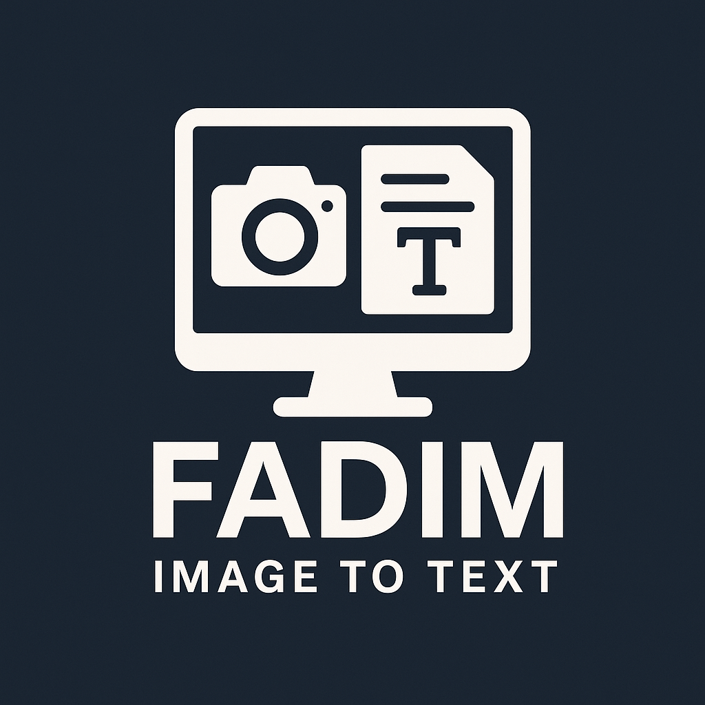

# FADIM - Görselden Metne (Image to Text)

FADIM (Fotoğrafı Al, Dönüştür, İndeksle, Metne) masaüstü için geliştirilmiş açık kaynaklı bir görselden metin çıkarma (OCR) ve arşivleme uygulamasıdır. Hem anlık ekran görüntülerinden hem de mevcut görsellerden metin çıkarabilir. Ayrıca metinleri `.txt` ve `.docx` olarak kaydeder, ekran kayıtlarını ve OCR geçmişini arşivler. Gelişmiş GIF kaydı özelliği de sunar.

**FADIM** is an open-source desktop application for image-to-text (OCR) and archiving. It can extract text from live screen captures or existing image files, automatically save the results as `.txt` or `.docx`, and archive both screenshots and OCR logs. It also includes a powerful GIF recording tool.

---

## 📌 Özellikler | Features

- 🖼️ Anlık ekran görüntüsünden OCR  
  🔹 Instant OCR from screen capture

- 🖼️ Mevcut görsellerden OCR  
  🔹 OCR from existing image files

- 💾 TXT ve DOCX formatında otomatik kayıt  
  🔹 Auto-save as TXT and DOCX

- 🗂️ OCR geçmişini ve ekran görüntülerini arşivleme  
  🔹 Archive OCR history and screenshots

- 🎞️ GIF formatında ekran kaydı yapma  
  🔹 Record screen as GIF

- 📸 Seri ekran görüntüsü alma desteği  
  🔹 Batch screen capture support

---

## 🔧 Kurulum | Installation

1. [En son sürümü indir](https://muallimun.com/muallim/listekolay/fadim/)  
   Download the latest version

2. İndirilen `.exe` dosyasını çalıştırın.  
   Run the downloaded `.exe` file.

3. Herhangi bir kurulum gerektirmez – taşınabilir (portable) yapıdadır.  
   No installation needed – it's portable.

---

## 📖 Kullanım | How to Use

1. Uygulamayı başlatın.  
   Launch the application.

2. `Ekranı Tara` butonuna basarak ekran görüntüsünden OCR yapın.  
   Click "Scan Screen" to perform OCR from a screenshot.

3. `GIF Kaydı Başlat` ile ekran kaydını başlatın.  
   Use "Start GIF Recording" to begin screen recording.

4. Çıktılar otomatik olarak kaydedilir.  
   Outputs are saved automatically.

5. Ayarlar menüsünden dili ve çıktı klasörünü özelleştirin.  
   Customize language and output directory from settings.

---

## ❓ Sık Sorulan Sorular | FAQ

**OCR neden başarısız olur?**  
🔸 Net olmayan görseller veya desteklenmeyen diller OCR sonucunu etkileyebilir.  
🔸 Blurry images or unsupported languages may cause OCR to fail.

**Çıktılar nereye kaydediliyor?**  
🔸 Varsayılan olarak uygulamanın kurulu olduğu klasörde `outputs` adlı bir klasöre kaydedilir.  
🔸 By default, outputs are saved in the `outputs` folder next to the application.

---

## 📁 Lisans | License

FADIM açık kaynaklıdır ve [MIT Lisansı](LICENSE) ile lisanslanmıştır.  
FADIM is open-source and licensed under the [MIT License](LICENSE).

---

## 💬 Katkı Sağlayın | Contribute

Pull request'ler ve hata raporları memnuniyetle kabul edilir!  
Pull requests and issue reports are welcome!

---

## 🌐 Web Sitesi

🔗 [https://muallimun.com/muallim/listekolay/fadim/](https://muallimun.com/muallim/listekolay/fadim/)

---

